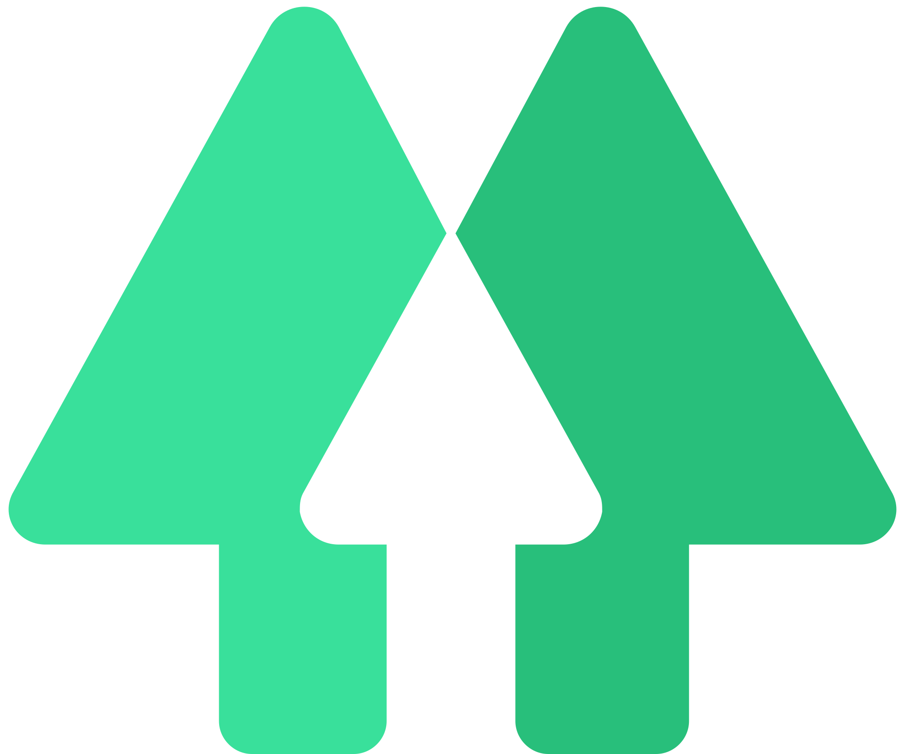

 

 I'm a self-taught passionate **FrontEnd developer** from India :india: 

#### About me

- 🧑🏻‍💻 FrontEnd Engineer at **Itera**

- 📮 Let's get in touch [🔗Mail me](mailto:connectwithsahilawasthi@gmail.com)

#### Languages and Tools:

<code></code>
<code></code>
<code></code>
<code></code>
<code></code>
<code></code>
<code></code>
<code></code>
<code></code>
<code></code>
<code></code>
<code></code>

|  |  |
| -------------------------------------------------------------------------------------------------------------------------------------------------------------------------------------------------------------------------------------------------------- | ----------------------------------------------------------------------------------------------------------------------------------------------------------------------------- |
|                                        |                                                                                                                        |

 
 

